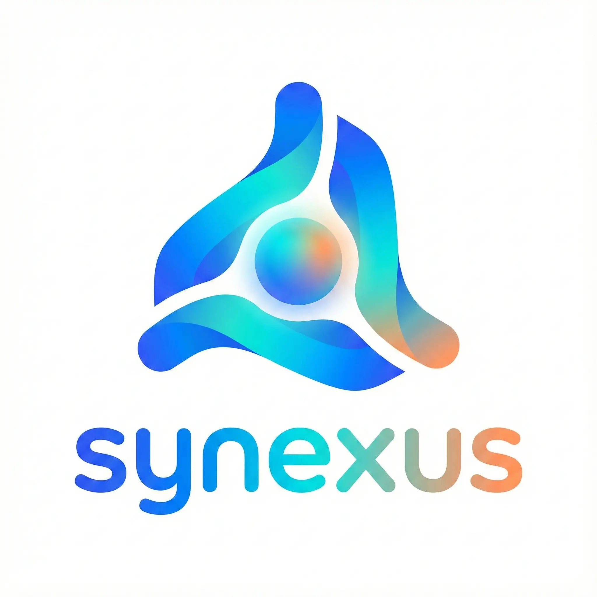

  

<h1 align="center">Synexus Development</h1>

  <strong>Bridging Enterprise Engineering with High-Performance Gaming Infrastructure.</strong>

  <a href="https://synexus.dev">🌐 Visit Website</a>
  &nbsp;|&nbsp;
  <a href="mailto:synexus.dev@protonmail.com">📧 Contact Us</a>
  &nbsp;|&nbsp;
  <a href="https://discord.gg/yf5BxbQsQ9">💬 Discord Community</a>

 

## 🚀 About Us

Welcome to the digital home of **Synexus**. We are a specialized software studio that brings the reliability of corporate systems into the world of gaming servers.

We believe that high-scale Minecraft networks deserve the same level of engineering as enterprise software. Our mission is to eliminate lag, synchronize data seamlessly, and build professional tools for server owners who mean business.

---

## ⚡ What We Do

We don't just write code; we build **infrastructure**.

### 🎮 For Game Networks
* **Seamless Synchronization:** Connecting your game servers with Discord and the Web in real-time.
* **Network Stability:** Tools designed to handle thousands of players without compromising performance.
* **Player Management:** Professional systems for economy, punishment, and player data.

### 🏢 For Business
* **Custom Software Solutions:** Tailor-made backend systems for companies.
* **Process Automation:** We connect your disparate tools into a single, unified workflow.

---

  <em>"The missing link in your digital project."</em>

  
  

